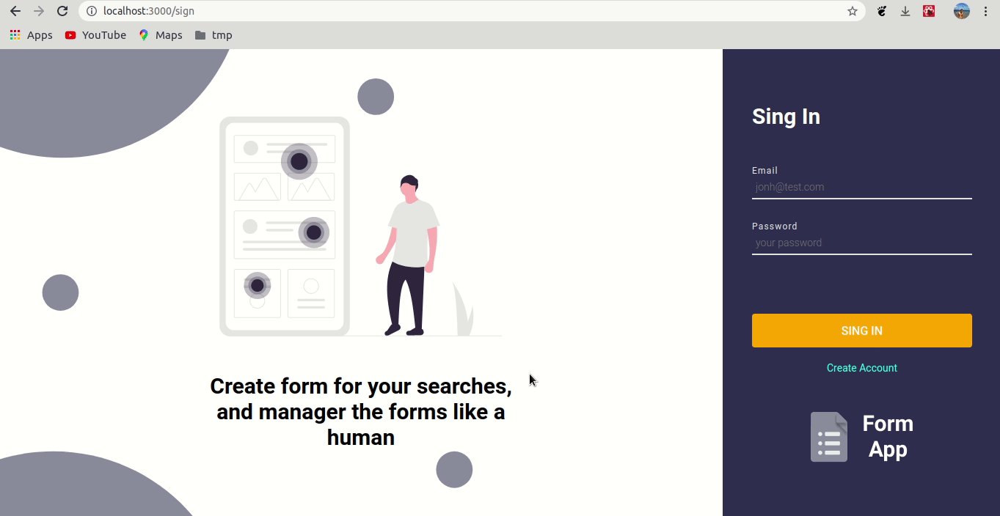

<h1 align="center">
  
</h1>

<p align="center">
  An app with JWT authentication and custom validation messages.
</p>

## 👨🏼‍💻 Development Contact

David Nascimento

- [Github](https://github.com/david32145)
- [nascimento32145@gmail.com](https://gmail.com)

## 🚶 User Stories

- [x] An user can be login in app;
- [x] An user can be create account in app;

## 🚀 Technologies

In the app was used an stack `javascript`, with `nodejs` in backend and `reactjs` in web.

### ♻️ Backend

- nodejs;
- typescript;
- eslint;
- dotenv;
- prettier;
- mongoose;
- jsonwebtoken;
- express;
- bcrypt;
- jest;
- nodemon.

### 🌐 Web

- reactjs;
- typescript;
- eslint;
- prettier;
- styled-components;
- axios;
- react-router-dom;

## 🎌 What I've learned

- Authentication with JWT;
- MongoDB database;
- API RESTful with express;
- Css-In-Js with styled-componets;
- Jest;
- Api Test, Mongo Mock.

## 🏘️ Page Examples

### Login Page

<h1 align="left">
  
</h1>

### Create Page

<h1 align="left">
  
</h1>

## 🎥 How Usage

Example how usage app.

### ✔️ Login And Create

<h1 align="left">
  
</h1>

## ✋🏻 Prerequisites

- [Node.js](https://nodejs.org/en/)
- [Yarn](https://yarnpkg.com/pt-BR/docs/install)
- [MongoDB](https://www.mongodb.com/)

## 🔥 Install and Running

1. Config you environment;
2. Git clone `git clone https://github.com/david32145/login-app`;
3. Enter in api folder;
4. Copy .env.example to .env and fill with your config, sever port by default is 3333. Below an example of `.env`;
```env
MONGODB_URL=localhost:27017
JWT_SECRET_KEY=potato
```
5. Run `yarn install` or `npm install`;
6. Run server with `yarn dev` or `npm run dev`;
7. Enter in web folder;
8. Copy .env.example to .env and fill with your config. Below an example of `.env`

```env
REACT_APP_API_URI=http://localhost:3333

```
9. Run `yarn start` or `npm run start`;